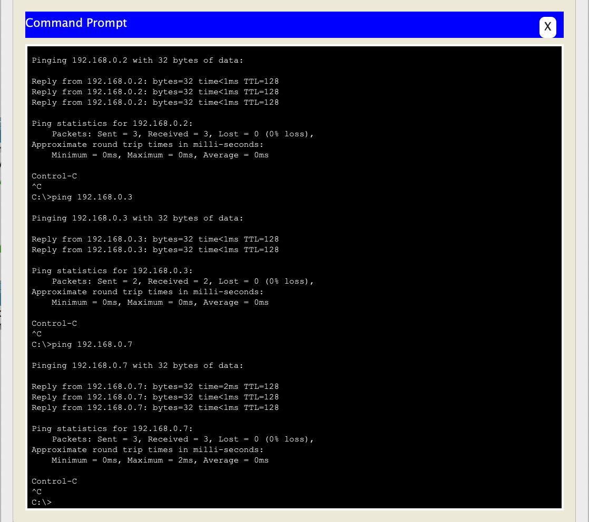
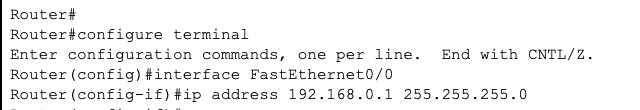

University: [ITMO University](https://itmo.ru/ru/) 
Faculty: [FICT](https://fict.itmo.ru) 
Course: [IP-telephony](https://github.com/itmo-ict-faculty/ip-telephony) 
Year: 2022/2023 
Group: K34202 
Author: Tasmaev Igor Aleksandrovich 
Lab: Lab1 
Date of create: 19.03.2023 
Date of finished:  

# Лабораторная работа №1 "Базовая настройка ip-телефонов в среде Сisco packet tracer"

## Описание
Для выполнения данной лабораторной работы собирается схема соединения. Необходимо проверить, правильно ли подключены и настроены все узлы устройств.

## Цель работы
Изучить рабочую среду Cisco Packet Tracer, ознакомить- ся с интерфейсами основных устройств, типами кабелей, научиться собирать топологию. Изучить построение сети IP-телефонии с помощью маршрутизатора, коммутатора и IP телефонов Cisco 7960 в среде Packet tracer

### Часть 1
Построена сеть, которая включает компьютеры и коммутаторы.

Каждому компьютеру были назначены статитические IP-адреса 192.168.0.1-192.168.0.7/24.

Была проверена достижимость каждого узла.

### Часть 2
Построена сеть, включающая в себя роутер, коммутатор и ip телефоны.

На маршрутизаторе настроен интерфейс Fa0/0, настроен DHCP-сервер, настроены услуги телефонии.

Настроены услуги телефонии на маршрутизаторе.

Созданы VLAN порты на коммутаторе для взаимодействия коммутатора с маршрутизатором

Осуществлен тестовый звонок с одного IP телефона на другой.

## Вывод:
В ходе выполнения лабораторной работы были реализованы две схемы сетей: схема с несколькими коммутаторами для связи компьютеров одной сети и схема реализации VOIP с маршрутизатором, при помощью инструментов Cisco Packet Tracer.