University: [ITMO University](https://itmo.ru/ru/) 
Faculty: [FICT](https://fict.itmo.ru) 
Course: [IP-telephony](https://github.com/itmo-ict-faculty/ip-telephony) 
Year: 2022/2023 
Group: K34202 
Author: Tasmaev Igor Aleksandrovich 
Lab: Lab2 
Date of create: 19.03.2023 
Date of finished: 20.03.2023 

# Лабораторная работа №2 "Конфигурация voip в среде Сisco packet tracer"

## Описание
Для выполнения данной лабораторной работы собирается схема соединения. Необходимо проверить, правильно ли подключены все узлы устройств. Предварительно удалить все преды- дущие конфигурационные файлы на маршрутизаторах Cisco 2811, на коммутаторе Cisco catalyst 3560.

## Цель работы
Иизучить построение сети IP-телефонии с помощью маршрутизатора Cisco 2811, коммутатора Cisco catalyst 3560 и IP телефонов Cisco 7960.

### Часть 1

Построена схема, нарисованная на первом рисунке.

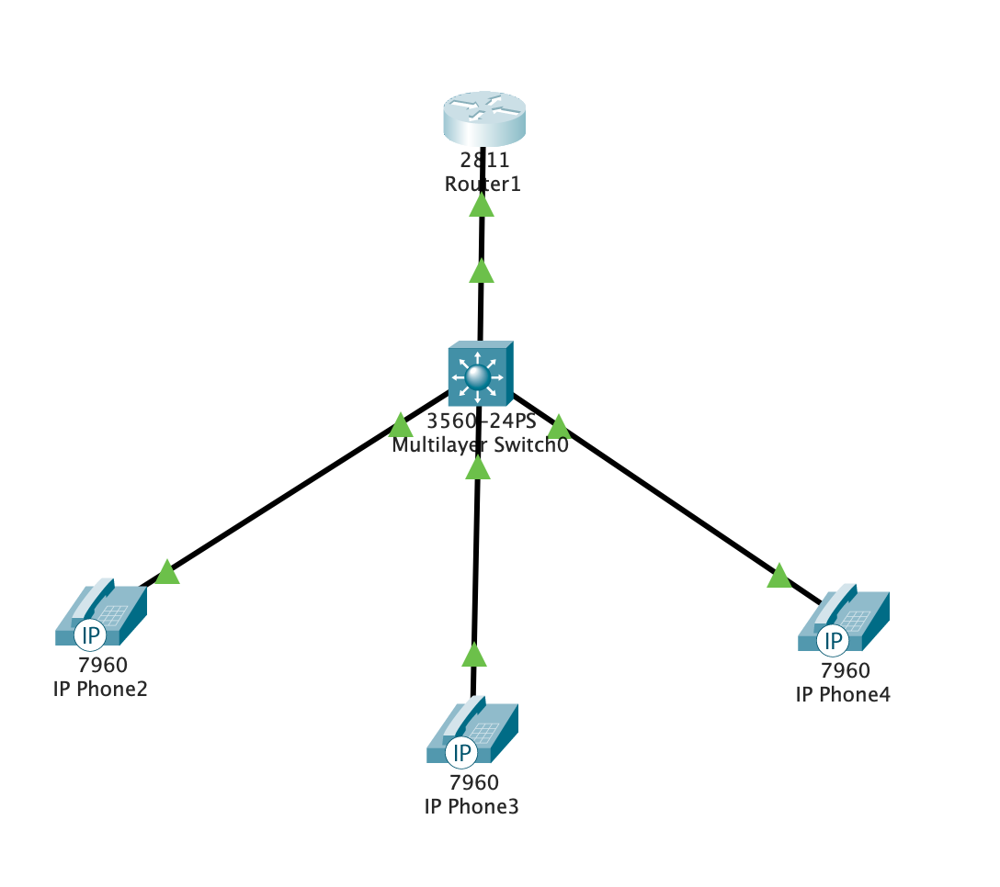

В конфигурационном режиме изменено название маршрутизатора на CMERouter. Отключен синтаксис ввода слов от DNS серверов. Заданы пароли для защиты маршрутизатора как в удаленном режиме, так и в режиме консоли.

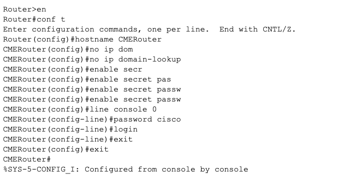

Настроен интерфейс fa0/0 на маршрутизаторе.

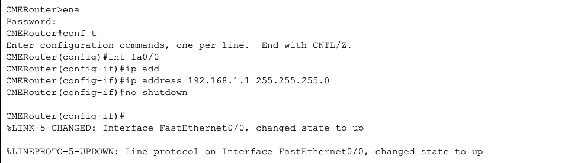

Настроен DHCP сервер. Настроены услуги телефонии на маршрутизаторе.

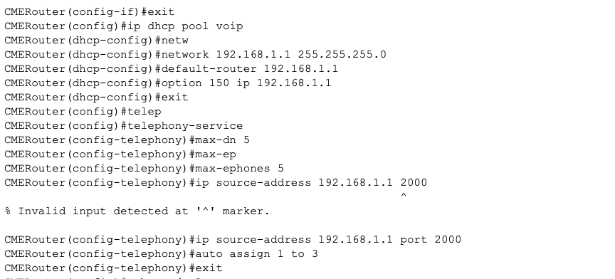
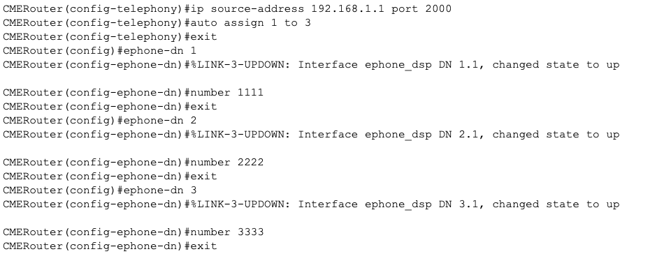

Созданы VLAN порты на коммутаторе для взаимодействия коммутатора с маршрутизатором, подключены IP телефоны.

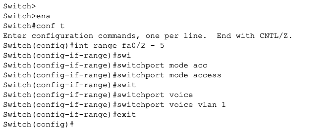

Осуществленна настройка IP-телефонов и их соединение с коммутатором. После чего осуществленны тестовые звонки.

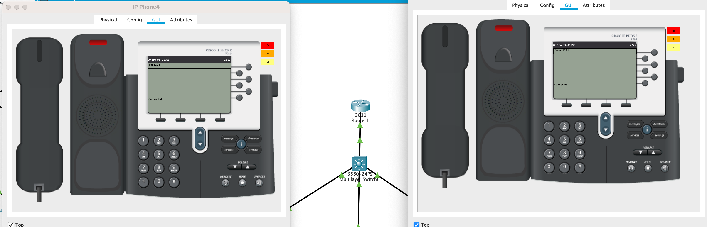

### Часть 2
Построена сеть, включающая в себя роутер, коммутатор и ip телефоны.

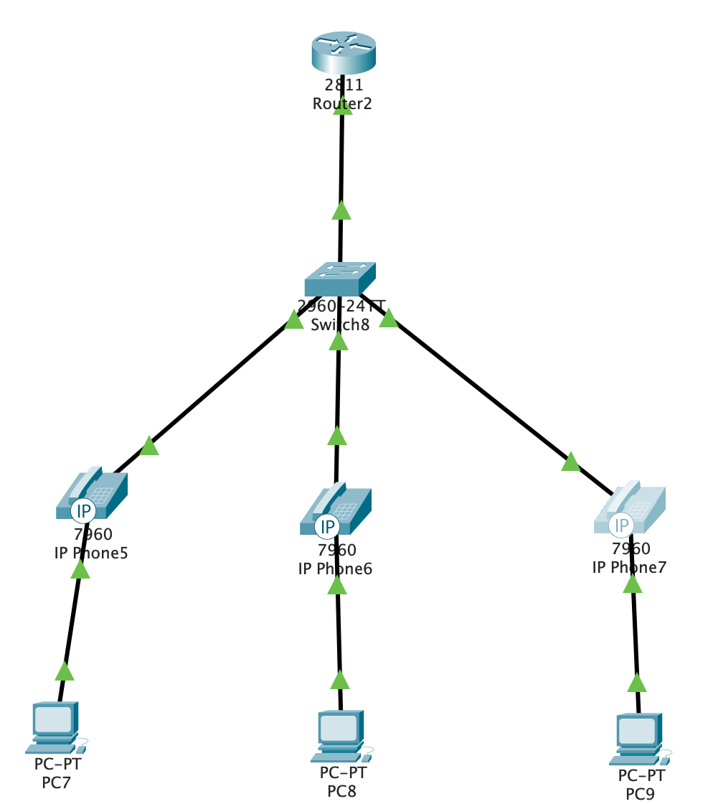

Созданы VLAN порты на коммутаторе для взаимодействия коммутатора с маршрутизатором и подключены IP телефоны.

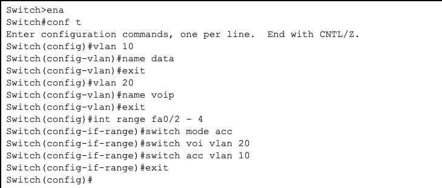

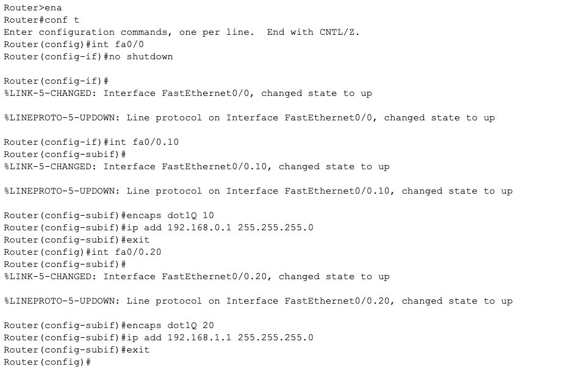

Задан маршрут по умолчанию командой ip default-gateway. Настроен порт как канал типа trunk.

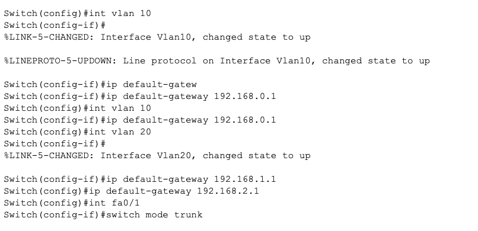

Настроены DHCP сервера для передачи голоса и данных на маршрутизаторе.

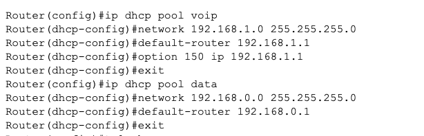

Настроены услуги телефонии на маршрутизаторе.

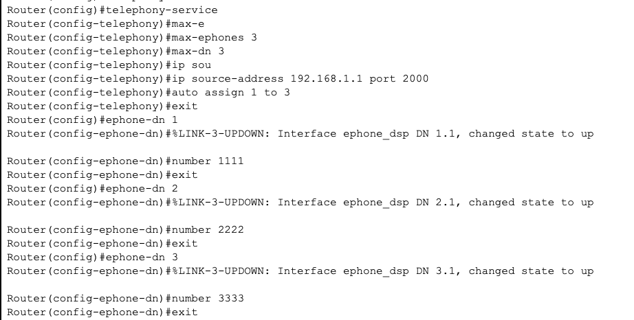

Проверена связь между компьютерами.

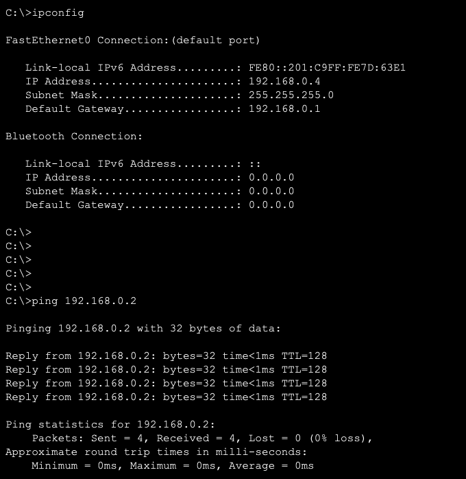

Проверены звонки между телефонами.

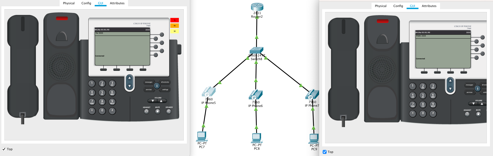

### Вывод:
В ходе выполнения лабораторной работы было изучено построение сети IP-телефонии с помощью маршрутизатора Cisco 2811, коммутатора Cisco catalyst 3560 и IP телефонов Cisco 7960, при помощью инструментов Cisco Packet Tracer.
