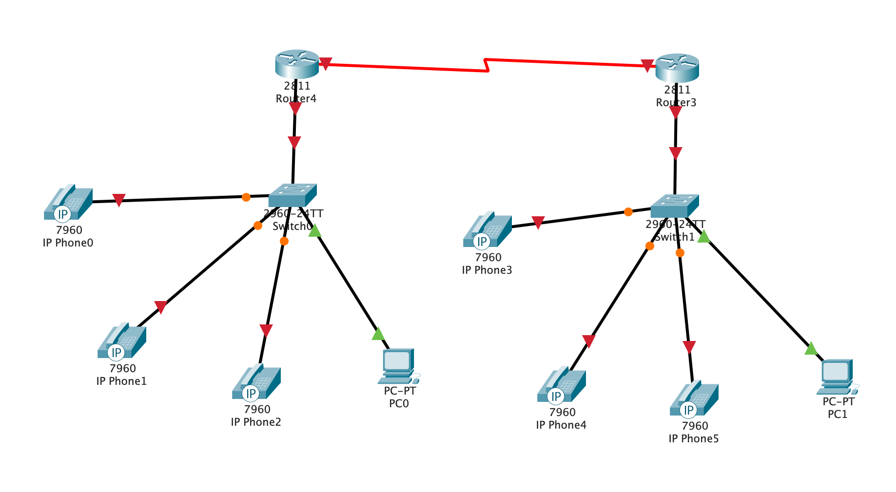
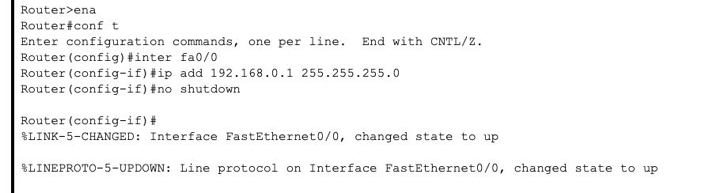
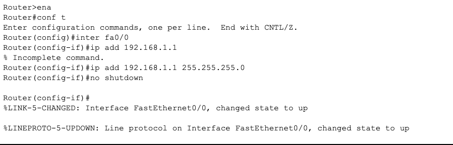
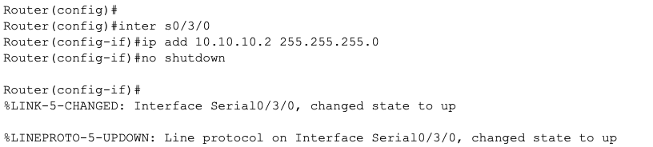
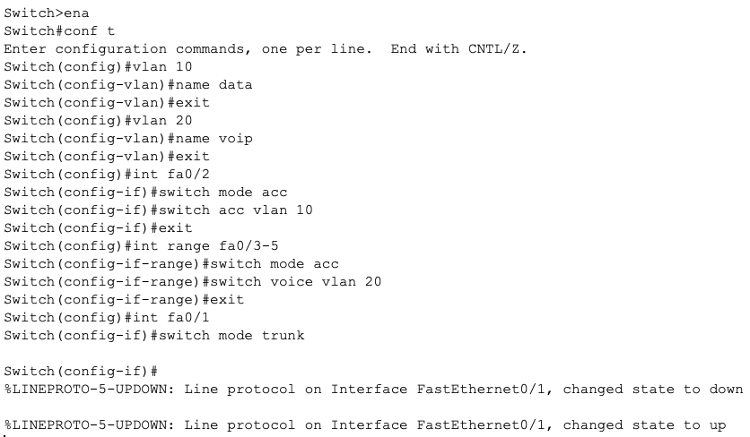
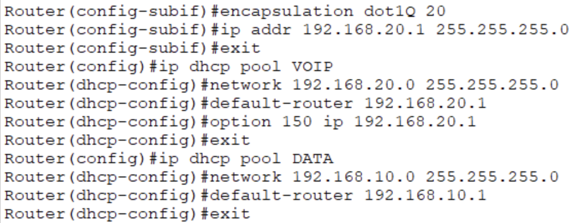
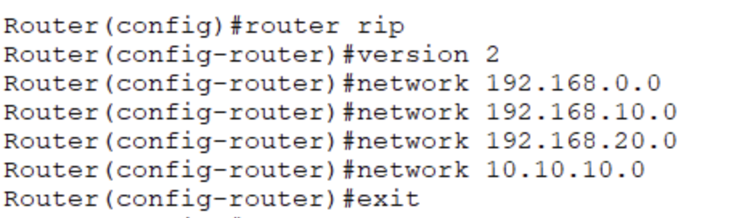
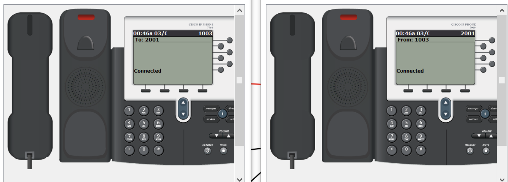

University: [ITMO University](https://itmo.ru/ru/) 
Faculty: [FICT](https://fict.itmo.ru) 
Course: [IP-telephony](https://github.com/itmo-ict-faculty/ip-telephony) 
Year: 2022/2023 
Group: K34202 
Author: Tasmaev Igor Aleksandrovich 
Lab: Lab4 
Date of create: 13.04.2023 
Date of finished:  

# Лабораторная работа №4 "Построение сети ip-телефонии между удаленными маршрутизаторами"

## Описание
Для выполнения данной лабораторной работы собирается схема соединения. Необходимо проверить, правильно ли подключены все узлы устройств.

## Цель работы
Изучить построение сети IP-телефонии между удаленными филиалами с помощью маршрутизаторов Cisco 2811 и коммутаторов Cisco 2950Т.

### Часть 1

Построена схема, нарисованная на первом рисунке.

Настроен интерфейс fa0/0 на маршрутизаторах Cisco 2811

Настроен интерфейс s0/3/0 на маршрутизаторах Cisco 2811.

Настроен маршрутизатор Cisco 2811, коммутатор Cisco 3950Т, IP-телефоны аналогично лабораторной работе №2.

Настроены DHCP сервера на маршрутизаторах для передачи голо- са и данных между ними.

Настроена динамическая маршрутизация RIP между маршрутизаторами для передачи информации друг другу.

Настроены услуги телефонии Cisco CallManager Express на маршрутизаторе 2811.
Проверены вызовы между удаленными IP-телефонами.

### Вывод:
В ходе выполнения лабораторной работы было изучено построение сети IP-телефонии между удаленными филиалами с помощью маршрутизаторов Cisco 2811 и коммутаторов Cisco 2950Т, при помощью инструментов Cisco Packet Tracer.